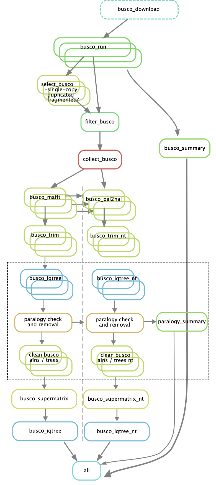
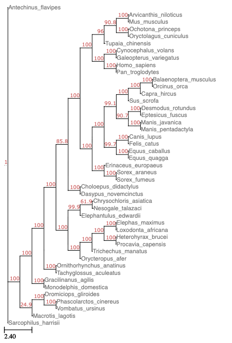

# Introduction

As part of the BioHackathon Europe 2025, we report on our project "Automatic workflow for benchmarking BUSCO genes for phylogenomics", where we aimed to design an end-to-end pipeline which identified gene sequences within given genomes, mapped orthologous genes to each other across species, performed a filtering of paralogs and then created a species tree from these filtered alignments.

Phylogenomics is a central aspect of biodiversity genomics, as it reveals the relationships among organisms and key evolutionary processes such as introgression and gene flow. Genome-scale datasets are increasingly a reality in phylogenomics due to the availability of genomes for an ever-growing number of species. BUSCO datasets (universal single-copy orthologs [@Tegenfeldt2024] ) have become standard in assessing genome assembly completeness and are fully integrated into the pipelines of large genome consortia such as ERGA. Due to their low-copy nature, BUSCO genes are also increasingly used in phylogenomics, from genome skimming data to high-quality chromosome-scale genomes. Yet, their phylogenetic performance has not been thoroughly explored. Preliminary analyses show that BUSCO genes can recover robust phylogenetic relationships, but their single-copy nature is challenged: most BUSCO genes display varying levels of paralogy when using biodiverse species sets, and failure to account for this can negatively affect phylogenetic reconstruction.

This  project aimed to build an automatic phylogenomics pipeline using the output of the BUSCO software. Contrary to existing pipelines, we aimed to explicitly resolve paralogy events, thereby resulting in larger and more informative datasets. This pipeline will be used to benchmark the phylogenetic performance of the newly defined BUSCO lineage datasets, identifying not only the prevalence and evolutionary depth of the various paralogs but also resolving them for improved phylogenetic utility of BUSCO genes. This project aimed to result in a fully-fledged FAIR-compliant phylogenomics pipeline based on BUSCO and an assessment of the phylogenetic performance of new BUSCO gene sets (version odb12).

# Methodology

During the BioHackathon, we aimed to adapt an existing Snakemake pipeline called [buscophy](https://gitlab.leibniz-lib.de/smartin/buscophy.git), which generated phylogenetic trees of species based on identified single-copy BUSCO genes. Our main aims were:

* Ensure the pipeline is fully FAIR and deployable on all computational systems

* Add an additional paralog filtering step, to allow the inclusion of multi-copy BUSCO genes in the phylogentic reconstructions

To address the first step, we modified existing conda yamls and containers to ensure that consistent versions were used, independent of which software management system was used, and that tools were readily available in Galaxy. The latter point required building wrappers for BUSCO version 6, pal2nal and amas within the Galaxy Australia platform.

The addition of the paralog filtering step required the construction of individual gene trees, instead of immediately concatentating alignments into a supermatrix, and then processing the alignments and gene trees via a separate rule. The filtered alignments would then be used to construct a supermatrix and the ultimate species tree (Fig. 1).

{ width=200px }

## Results

Table: Pull Requests detailing tools requiring Galaxy wrappers

| Tool | URL |
| -------- | -------- |
| pal2nal | https://github.com/galaxyproject/tools-iuc/pull/7444 |
| amas | https://github.com/galaxyproject/tools-iuc/pull/7443 |
| BUSCO | https://github.com/galaxyproject/tools-iuc/pull/7139 |

{ width=200px }

# Discussion

## Acknowledgements

## References
